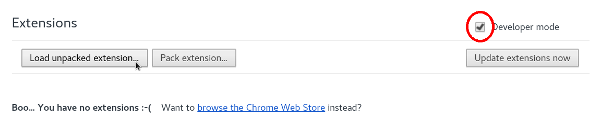

**ARCHIVED**

This repository is archived, please see the new repository [here](https://github.com/MetroPlatform/Metro-BrowserExtension)

## Introduction ##

This is the Chrome extension used to power Metro. The main work is done in
`scriptLoader.js`. It runs on every page and handles the loading in of
different datasources that you have enabled.

Within the `runDataSource` function, you have the `MetroClient` object. This is
passed to each datasource that is enabled and handles the communication between
the datasource and the Metro backend. It abstracts away the storing/reading of
data in local storage for the extension and the pushing of a datapoint to the
Metro backend.

PRs and Issues are welcome.

## Install ##

1. First download the Metro extension from [here](https://github.com/MetroPlatform/MetroChromeExtension/archive/master.zip). Right click on the downloaded zip file and unzip it.

2. Now type or copy/paste chrome://extensions into the address bar and press enter. This will open the extensions settings page.

3. When you have the extensions page open, enable the developer mode checkbox and click on Load Unpacked Extension.

4. Navigate to the folder you unzipped earlier, select it and press open. You're now ready to start using Metro!

Open the extension and select the checkbox to allow Metro to start gathering
data. This can be disabled/re-enabled at any time.
